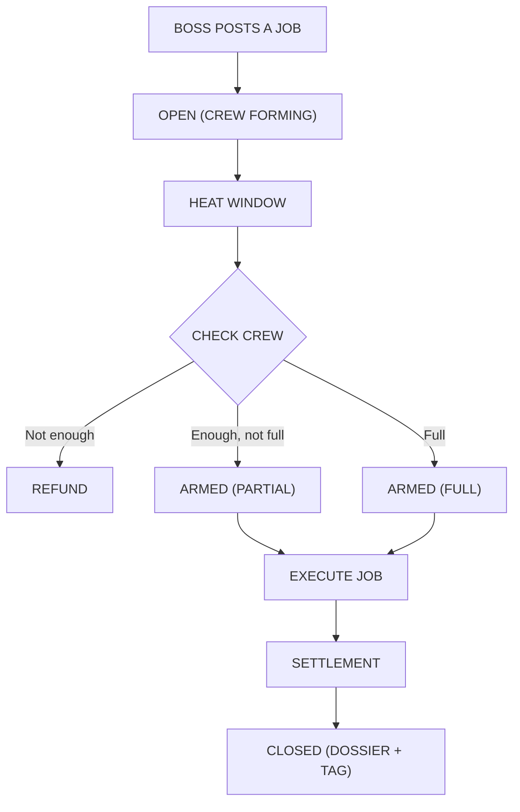

## Intro

Welcome to **San Taovanni**, a mob-run district inside Tensor City.

**The Taofather** is a mob-themed Bittensor subnet where volatility becomes a public game: **Bosses** post jobs, **Mobsters** form crews, and **Consiglieres** keep the books.

The Family’s currency is **MOB-α** (“Mob Alpha”). Use it to sponsor jobs, earn envelopes, climb ranks, and build a reputation that lives on the **Job Board**.

> **Important:** Any TAO-equivalent examples use a reference input `p_alpha` for accounting. It’s not a peg and not a guarantee | it’s just a “street price” input used to compare values in examples.

---

## Table of Contents

- [Intro](#intro)
- [The Game Loop](#the-game-loop)
- [Quick Rules (The Money)](#quick-rules-the-money)
  - [Two payouts, always separate](#two-payouts-always-separate)
  - [What gets traded in each job](#what-gets-traded-in-each-job)
  - [Settlement from every job](#settlement-from-every-job)
- [Job Types](#job-types)
  - [Hits](#hits)
  - [Rackets](#rackets)
- [Roles](#roles)
- [MOBnet Slang (Mini Glossary)](#mobnet-slang-mini-glossary)
- [Arming + Execution Window (Anti-Gaming)](#arming--execution-window-anti-gaming)
  - [Phase A — Heat Window (Fill Phase)](#phase-a--heat-window-fill-phase)
  - [Phase B — Execution Window (Armed Phase)](#phase-b--execution-window-armed-phase)
  - [Verifiable randomness (audit-friendly)](#verifiable-randomness-audit-friendly)
- [Job Board Visibility (Obfuscated Until Execution)](#job-board-visibility-obfuscated-until-execution)
  - [What the public can see (before execution)](#what-the-public-can-see-before-execution)
  - [What is hidden (until after execution)](#what-is-hidden-until-after-execution)
  - [After execution (full transparency)](#after-execution-full-transparency)
- [Fill Thresholds + Refund / Underfill Fees](#fill-thresholds--refund--underfill-fees)
  - [Mode 1 (Recommended): 2 thresholds → 3 outcomes](#mode-1-recommended-2-thresholds--3-outcomes)
  - [Mode 2 (Advanced): 3 thresholds → “tight control”](#mode-2-advanced-3-thresholds--tight-control)
  - [Boss fee schedule (slightly higher fees for REFUND or NOT FULL)](#boss-fee-schedule-slightly-higher-fees-for-refund-or-not-full)
- [Boss Job Submission (Checklist)](#boss-job-submission-checklist)
  - [Hit Checklist](#hit-checklist)
  - [Racket Checklist](#racket-checklist)
- [Ranks, Families, and Reputation](#ranks-families-and-reputation)
- [Boss “Skin Ratio” (Risk + Upside Slider)](#boss-skin-ratio-risk--upside-slider)
- [Tags (BOTCHED / MESSY / CLEAN / LEGENDARY)](#tags-botched--messy--clean--legendary)
- [Kickback + Street Tax Schedule (Aligned to Tags)](#kickback--street-tax-schedule-aligned-to-tags)
- [Skin Ratio Modifiers](#skin-ratio-modifiers)
- [Boss Deposits (What Exactly Is Required)](#boss-deposits-what-exactly-is-required)
- [Job Flow (What Actually Happens)](#job-flow-what-actually-happens)
  - [Hit Flow](#hit-flow)
  - [Racket Flow](#racket-flow)
- [Appendix A — The Books (Math & Definitions)](#appendix-a--the-books-math--definitions)
- [Appendix B — Boss Hit Submission Template](#appendix-b--boss-hit-submission-template)
- [Appendix C — Boss Racket Submission Template](#appendix-c--boss-racket-submission-template)
- [Value Proposition](#value-proposition)
- [FAQ](#faq)
- [Disclaimer](#disclaimer)

---

## The Game Loop

Jobs come in two flavors:
- **Hit** = pooled **sell** of a target subnet’s alpha (force price discovery / stress test)
- **Racket** = pooled **buy** using TAO (build stake / reward strong subnets)

High level loop (both job types):

1) **A Boss** picks a target subnet and posts a job on the **Job Board**  
2) Boss posts the **required deposits** for that job type  
3) **Mobsters** join by contributing the job’s required asset (target alpha for hits, TAO for rackets)  
4) **Heat Window** ends → the pool is evaluated against the Boss’s **fill thresholds**  
   - Too little crew → **REFUND**
   - Enough crew → **ARMED**
5) If **ARMED**, the protocol executes **one batched trade** at a **random time** inside an **Execution Window** (anti-gaming)  
6) The output is settled into:
   - **Protocol take (TAO)**
   - **Boss kickback (TAO)**
   - **Pro-rata payout** (TAO or target alpha, depending on job type)
7) Consiglieres compute **Street Heat** and publish the dossier  
8) Boss MOB-α escrow is “washed” back (bounded), with a loss split **burn + blessing**  
9) Participants earn **Envelope** rewards (see each job type)  
10) The job becomes lore: **BOTCHED / MESSY / CLEAN / LEGENDARY**, ranks, Families, leaderboards

### Status Lifecycle (applies to Hits + Rackets)

| Status     | When it happens                                                               | What it means (1 sentence)                                                              | Can deposits change?                  |
| ---------- | ----------------------------------------------------------------------------- | --------------------------------------------------------------------------------------- | ------------------------------------- |
| **OPEN**   | Immediately after Boss posts the job                                          | Job is in the **Heat Window** collecting deposits.                                      | **Yes** (Boss + Mobsters can deposit) |
| **ARMED**  | After Heat Window ends **and** thresholds allow execution                     | Job is **locked** and will execute **once** at a **random time** inside `E_min..E_max`. | **No** (inventory frozen)             |
| **REFUND** | After Heat Window ends and `F < θ_refund` (or Boss-selected refund condition) | Job is canceled: deposits return; Boss pays the cancel fee (if configured).             | **No**                                |
| **CLOSED** | After the randomized execution + settlement completes                         | Job is finished, and the full dossier (payouts/heat/tag/proof) is published.            | **No**                                |

---

## Quick Rules (The Money)

### Two payouts, always separate

Every job produces **two independent payout streams**:

1) **Main settlement payout** (the “trade result”)
   - **Always strict pro-rata** by the asset contributed to the job  
   - Not influenced by reputation, MOB-α, tags, or anything else

2) **Envelope payout** (the “mining” reward)
   - Influenced by **contribution + reputation (Rep)**  
   - Paid in a job-specific envelope mix (see below)

### What gets traded in each job

- **Hit:** sells **only target subnet alpha** (batched sell)  
  - Boss contributes `X_boss` target alpha (minus vault skim)  
  - Mobsters contribute `d_i` target alpha  
  - Output is **TAO proceeds**

- **Racket:** buys target subnet alpha using **pooled TAO** (batched buy)  
  - Mobsters contribute `t_i` TAO into the pool  
  - Output is **target subnet alpha acquired**

**MOB-α is never converted** as part of the main trade in either job type.
MOB-α is used for deposits, burns, escrow, and envelopes.

### Settlement from every job

Both job types produce some primary trade output value. From that, the protocol takes:

- **Taofather take:** `t = 1.5%` (base; may increase slightly for underfilled execution)
- **Boss Kickback:** `b_eff(I', ρ)` (tag-based 1–3%, improved by Boss skin)
- The rest goes to the **Pro-rata pool payout** (strictly by contribution)

---

## Job Types

### Hits

**Hit = pooled SELL** of target subnet alpha → produces TAO.

- **Main payout:** TAO (strict pro-rata by target alpha contributed)
- **Envelope payout:** MOB-α (Rep-weighted) *(unchanged from prior design)*

### Rackets

**Racket = pooled BUY** using TAO → produces target subnet alpha.

- **Main payout:** target subnet alpha (strict pro-rata by TAO contributed)
- **Envelope payout:** a **mix** of:
  - **Target subnet alpha** (bonus units)
  - **MOB-α**
  
This makes rackets feel like “community buying pressure + rewards” while still keeping settlement auditable.

> Design intent: Hits stress-test and reveal weak subnets; Rackets reward strong ones and coordinate buys without centralized gatekeepers.

---

## Roles

### The Taofather (Subnet Owner)
Runs the city. Sets the street rules. Collects the take.

### Boss (Job Sponsor)
Opens jobs. Posts deposits. Sets thresholds and timing rules. Earns kickback.

### Mobsters (Crew / Miners)
Provide the pooled asset (target alpha for hits, TAO for rackets). Earn main payout + envelopes. Build reputation.

### Consiglieres (Validators / Bookkeepers)
Compute Street Heat and Rep. Validate settlement math. Publish dossiers and leaderboards.

---

## MOBnet Slang (Mini Glossary)

- **Job** — a posted pool with rules + deposits + an eventual batched trade  
- **Hit** — pooled batched **sell** of target alpha  
- **Racket** — pooled batched **buy** of target alpha using TAO  
- **Job Board** — public list of jobs (open + completed)  
- **Heat Window** — fill phase (crew deposits are allowed)  
- **ARMED** — job locked and eligible to execute; inventory can’t change  
- **Execution Window** — randomized execution phase after arming (exact time unknown)  
- **Fill Ratio** — how full the pool is at Heat Window close  
- **Underfilled Execute** — job runs even though the pool didn’t fully fill  
- **Street Heat** — impact score (“did the streets feel it?”)  
- **Street Tax Hold** — Boss’s held tribute (max-rate hold), finalized after the job  
- **Wash** — returning Boss MOB-α escrow (bounded)  
- **The Blessing** — Taofather’s share of escrow loss  
- **The Envelope** — job rewards paid to participants (Rep-weighted)  
- **BOTCHED / MESSY / CLEAN / LEGENDARY** — tags based on impact/quality  
- **The take** — Taofather’s TAO cut from every job (`1.5%` base)  
- **Kickback** — Boss bonus from the job’s value (tag-based, up to `3%`)

---

## Arming + Execution Window (Anti-Gaming)

To prevent timing games (sniping the last second, coordinating external liquidity, etc.), **jobs do not execute at a known timestamp**.

We separate time into two phases:

### Phase A — Heat Window (Fill Phase)

During the Heat Window, deposits are allowed.

- Duration: `T_fill`
- Deposits allowed:
  - **Hit:** Boss `X_boss`, Mobsters `d_i` (target alpha)
  - **Racket:** Mobsters `t_i` (TAO)
- At `T_fill` end, the pool is evaluated against **fill thresholds** chosen by the Boss (bounded by protocol limits)

Define:
- `C` = total pool capacity (units depend on job type)
- `Q_filled` = total deposits after any vault skims
- Fill ratio:

$$
F=\frac{Q_{filled}}{C}
$$

### Phase B — Execution Window (Armed Phase)

If the pool qualifies, it becomes **ARMED**:

- **Inventory is frozen** (no deposits, no withdrawals)
- The protocol executes **once** at a **random time** inside a fixed window:
  - **E_min = 15 minutes**
  - **E_max = 7200 minutes (5 days)**
- The **exact** execution time is **not disclosed** ahead of time—only the bounds.

> **Display rule:** The Job Board shows “ARMED — executes sometime between **+15m** and **+7200m** after arming.”

### Verifiable randomness (audit-friendly)

Let:
- `B_arm` = chain block when the pool becomes ARMED  
- `Δ_min`, `Δ_max` = min/max delay in blocks (maps to `E_min/E_max`)  
- `R(B_arm)` = chain randomness derived from `B_arm` (runtime-provided randomness source)

Then the execution block is:

$$
B_{exec}=B_{arm}+\Delta_{min}+\Big(R(B_{arm})\ \bmod\ (\Delta_{max}-\Delta_{min}+1)\Big)
$$

This makes execution **unpredictable** to participants, but **deterministic & auditable** after the fact.

---

## Job Board Visibility (Obfuscated Until Execution)

To reduce gaming, coordination, and front-running, **active jobs are obfuscated until the moment they execute**.

### What the public can see (before execution)

While a job is **OPEN (filling)** or **ARMED (scheduled)**, the public Job Board shows only:

- **Job type:** HIT or RACKET
- **Target subnet** (e.g., `T=1`)
- **Reason / thesis** (plain-English justification provided by the Boss)
- **Status**: OPEN or ARMED
- **Heat Window duration** (`T_fill`)
- **Execution Window bounds** (`E_min..E_max`) *(optional; can be shown as “executes within X–Y after arming”)*

### What is hidden (until after execution)

Until execution, the following details are **not shown publicly**:

- Pool capacity `C` and current fill ratio `F`
- Exact thresholds (`θ_refund`, `θ_partial`, `θ_full`)
- Deposits / inventory (Boss + Mobsters)
- Any per-wallet participation data
- The exact execution time (only the window bounds may be shown)

### After execution (full transparency)

Once execution happens, the dossier becomes public and includes:

- Final inventory traded (`Q_filled`) and proceeds/outcome
- take, kickback, pool pot, and strict pro-rata payouts
- Street Heat `I'`, tag (BOTCHED/MESSY/CLEAN/LEGENDARY)
- Any refund / underfill penalties applied to the Boss
- The randomness proof / audit trail for `B_exec`

**Design intent:** *Hide what can be gamed, publish what can be audited.*

---

## Fill Thresholds + Refund / Underfill Fees

Bosses can choose how strict the crew’s fill requirement is.

We support **two threshold modes**:

### Mode 1 (Recommended): 2 thresholds → 3 outcomes

Boss chooses:
- `\theta_{refund}` (refund threshold)
- `\theta_{full}` (full threshold)

Protocol requires:

$$
0 < \theta_{refund} < \theta_{full} \le 1
$$

Outcomes at Heat Window close:

- If `F < \theta_{refund}` → **REFUND**
- If `\theta_{refund} \le F < \theta_{full}` → **EXECUTE (NOT FULL)** (arms and executes, but Boss pays an extra fee)
- If `F \ge \theta_{full}` → **EXECUTE (NORMAL)**

**Suggested defaults (ship-it preset):**
- `\theta_{refund}=0.40`
- `\theta_{full}=0.90`

### Mode 2 (Advanced): 3 thresholds → “tight control”

Boss chooses:
- `\theta_{refund}` (refund)
- `\theta_{partial}` (allow underfilled execution)
- `\theta_{full}` (normal execution)

With:

$$
0 < \theta_{refund} < \theta_{partial} < \theta_{full} \le 1
$$

Outcomes:
- `F < \theta_{refund}` → REFUND  
- `\theta_{refund} \le F < \theta_{partial}` → REFUND  
- `\theta_{partial} \le F < \theta_{full}` → EXECUTE (NOT FULL)  
- `F \ge \theta_{full}` → EXECUTE (NORMAL)

### Boss fee schedule (slightly higher fees for REFUND or NOT FULL)

We add small, Boss-only penalties to prevent “free option” spam.

#### A) REFUND fee (Boss-only)

If the pool refunds, deposits are returned, but the Boss pays a **cancellation fee** in MOB-α:

$$
A_{cancel}=f_{cancel}\cdot A_{boss}
$$

Recommended:
- `f_{cancel} = 0.50%` (and optionally a minimum absolute floor)

#### B) Underfilled execution fee (Boss-only)

If the job executes but is not full, we add a small penalty that scales with how underfilled it is.

Define underfill severity:

$$
U=\text{clamp}\left(\frac{\theta_{full}-F}{\theta_{full}-\theta_{refund}},\;0,\;1\right)
$$

**Option 1 (recommended): Underfill take bump (TAO-side, simple audit)**  
Let base take be `t = 1.5%`. For underfilled execution:

$$
t_{eff}=t+\Delta t\cdot U
$$

Recommended: `\Delta t = 0.50%` max bump.

**Option 2 (optional): Underfill burn (MOB-α-side)**  
Add an extra Boss burn:

$$
A_{under}=f_{under}\cdot U\cdot A_{boss}
$$

Recommended: `f_{under} = 0.50%` (max when `U=1`).

> **Design intent:** Bosses can allow underfilled execution, but it should cost *slightly more* than a clean, full job.

---

## Boss Job Submission (Checklist)

### Hit Checklist

To post a **Hit**, a Boss must specify **timing**, **thresholds**, and **both deposits**:

- **Job type:** HIT
- **Target subnet `T`** (the `alpha_T` being sold)
- **Heat Window**: `T_fill` and **pool capacity** `C` (in `alpha_T` units)
- **Fill thresholds**:
  - Mode 1 (recommended): `θ_refund`, `θ_full`
  - Mode 2 (advanced): `θ_refund`, `θ_partial`, `θ_full`
- **Execution Window bounds** (randomized execution after arming):
  - `E_min`, `E_max`
- **Boss deposits**:
  - `A_boss` (MOB-α deposit)
  - `X_boss` (target alpha deposit)

> Full submission form: see **Appendix B — Boss Hit Submission Template**.

### Racket Checklist

To post a **Racket**, a Boss must specify **timing**, **thresholds**, and the required deposits:

- **Job type:** RACKET
- **Target subnet `T`** (the `alpha_T` being bought)
- **Heat Window**: `T_fill` and **pool capacity** `C` (in TAO units)
- **Fill thresholds** (same as hits):
  - Mode 1 (recommended): `θ_refund`, `θ_full`
  - Mode 2 (advanced): `θ_refund`, `θ_partial`, `θ_full`
- **Execution Window bounds**:
  - `E_min`, `E_max`
- **Boss deposits**:
  - `A_boss` (MOB-α deposit)
  - *(Optional but recommended)* **Boss TAO “lead-in”** `T_boss` (TAO contributed to the pool to signal conviction)

> Full submission form: see **Appendix C — Boss Racket Submission Template**.

---

## Ranks, Families, and Reputation

### Boss Ranks (by successful sponsorship)
Associate → Capo → Underboss → Don

### Mobster Ranks (by successful crew runs)
Runner → Soldier → Made → Enforcer

### Families (Teams)
Mobsters can affiliate with a **Family** (tag/registry). Families have:
- leaderboards (volume, heat, win-rate)
- “made men” lists
- rivalries (optional narrative layer)

### Mobster Reputation (Rep)
Reputation is a rolling score (validators compute & publish it) that reflects:
- participation volume and consistency
- quality outcomes (CLEAN/LEGENDARY bias)
- penalties for griefing/aborts/bad behavior

**Rep affects Envelopes only** — never the strict pro-rata settlement payout.

---

## Boss “Skin Ratio” (Risk + Upside Slider)

Bosses choose how much target alpha to put up relative to their MOB-α deposit.  
The more target alpha they post, the **less risk** they take on MOB-α and the **more upside** they earn via kickback quality.

We define a **Boss Skin Ratio** using TAO-equivalent accounting comparison:

- `A_boss` = MOB-α deposit  
- `X_boss` = Boss target alpha deposit (units of `alpha_T`)  
- `P0` = pre-job price of `alpha_T` in TAO (TAO per alpha)  
- `p_alpha` = reference street price of MOB-α in TAO (accounting only)

MOB-α notional:

$$
N_A = A_{boss}\cdot p_{\alpha}
$$

Target-alpha notional:

$$
N_X = X_{boss}\cdot P0
$$

Boss Skin Ratio:

$$
\rho = \frac{N_X}{N_A} = \frac{X_{boss}\cdot P0}{A_{boss}\cdot p_{\alpha}}
$$

### Recommended bands

- **Minimum to open a job:** `ρ ≥ 0.50`
- **Recommended “serious boss” band:** `ρ = 1.0 – 2.0`
- **Cap benefits:** `ρ ≥ 3.0` (extra target alpha is allowed; benefit stops increasing)

Normalize:

$$
\rho_{norm}=\text{clamp}\left(\frac{\rho-0.50}{2.00-0.50},\,0,\,1\right)
$$

---

## Tags (BOTCHED / MESSY / CLEAN / LEGENDARY)

Tags are primarily determined by **Street Heat** `I'_{job}` (impact adjusted by depth).

Let `I' = I'_{job}`:

- **BOTCHED**: `I' < 0.15`  
- **MESSY**: `0.15 ≤ I' < 0.35`  
- **CLEAN**: `0.35 ≤ I' < 0.75`  
- **LEGENDARY**: `I' ≥ 0.75`

---

## Kickback + Street Tax Schedule (Aligned to Tags)

Boss incentives have two tag-aligned levers:
1) **Kickback** (TAO, paid out of the job’s value) rises with tag quality  
2) **Street Tax** (MOB-α) falls with tag quality  
Then **Boss Skin Ratio `ρ`** improves both (lower risk / more upside).

### Base Boss Kickback `b(I')`

| Tag | Street Heat `I'` | Boss Kickback `b(I')` |
|---|---:|---:|
| BOTCHED | `< 0.15` | `1.00%` |
| MESSY | `0.15 – 0.35` | `1.00% → 2.00%` (linear) |
| CLEAN | `0.35 – 0.75` | `2.00% → 2.75%` (linear) |
| LEGENDARY | `≥ 0.75` | `3.00%` |

$$
b(I')=
\begin{cases}
0.0100 & I' < 0.15\\
0.0100 + 0.0100\cdot\frac{I' - 0.15}{0.20} & 0.15\le I' < 0.35\\
0.0200 + 0.0075\cdot\frac{I' - 0.35}{0.40} & 0.35\le I' < 0.75\\
0.0300 & I' \ge 0.75
\end{cases}
$$

### Base Street Tax `τ(I')`

| Tag | Street Heat `I'` | Street Tax `τ(I')` |
|---|---:|---:|
| BOTCHED | `< 0.15` | `5.00%` |
| MESSY | `0.15 – 0.35` | `5.00% → 4.00%` (linear) |
| CLEAN | `0.35 – 0.75` | `4.00% → 3.00%` (linear) |
| LEGENDARY | `≥ 0.75` | `2.50%` |

$$
\tau(I')=
\begin{cases}
0.0500 & I' < 0.15\\
0.0500 - 0.0100\cdot\frac{I' - 0.15}{0.20} & 0.15\le I' < 0.35\\
0.0400 - 0.0100\cdot\frac{I' - 0.35}{0.40} & 0.35\le I' < 0.75\\
0.0250 & I' \ge 0.75
\end{cases}
$$

---

## Skin Ratio Modifiers

### Street Tax discount modifier

$$
m_{\tau}(\rho)=1-0.30\cdot \rho_{norm}
$$

$$
\tau_{eff}(I',\rho)=\tau(I')\cdot m_{\tau}(\rho)
$$

### Kickback multiplier

$$
m_{b}(\rho)=0.90+0.20\cdot \rho_{norm}
$$

$$
b_{eff}(I',\rho)=\min(0.03,\; b(I')\cdot m_{b}(\rho))
$$

### Wash minimum floor

$$
\beta_{min}(\rho)=0.80+0.10\cdot \rho_{norm}
$$

---

## Boss Deposits (What Exactly Is Required)

### 1) MOB-α deposit `A_boss` (bounded-risk deposit)

- **Family Vault:** `v = 2.5%` of `A_boss`
- **Street Tax:** `\tau_{eff}(I',\rho)\cdot A_{boss}` (final burn)
- **Escrow (washable):** remainder, returned per wash formula (bounded by `β_min(ρ)`)

**Street Tax Hold mechanics (boss-friendly):**
- At creation, the protocol holds the **max** possible tax (5% of `A_boss`) as a temporary hold.
- After the job, the final Street Tax burned is computed using `τ_eff(I',ρ)`.
- Any held amount above the final tax is **rebated back into escrow**.

**Refund / Underfill fees (anti-spam + accountability):**
- See **Fill Thresholds + Refund / Underfill Fees** above.
- Fees are paid by the **Boss**, not by Mobsters.

### 2) Job-specific deposits

#### For Hits: Target alpha deposit `X_boss` (boss must be a participant)

- **Family Vault skim (target alpha):** `ν_X·X_boss` where `ν_X ∈ [0.25%, 1.00%]`
- **Sold in hit (if ARMED):** `X'_boss = X_boss - X_vault`

#### For Rackets: Optional Boss TAO “lead-in” `T_boss`

- Not required by protocol, but recommended as a “skin in the game” signal.
- Treated the same as other TAO deposits for strict pro-rata settlement payout.

---

## Job Flow (What Actually Happens)

### Hit Flow

1) Boss posts a Hit (chooses: `T_fill`, thresholds, `A_boss`, `X_boss`)  
2) Crew forms (Mobsters deposit target alpha)  
3) Heat Window closes → REFUND or ARMED  
4) Randomized execution: one batched **SELL** of target alpha  
5) Settlement: TAO proceeds split (take, kickback, pro-rata TAO payouts)  
6) Books close: heat computed, tax finalized, escrow washed, envelopes paid, dossier published

### Racket Flow

1) Boss posts a Racket (chooses: `T_fill`, thresholds, `A_boss`, optional `T_boss`)  
2) Crew forms (Mobsters deposit TAO)  
3) Heat Window closes → REFUND or ARMED  
4) Randomized execution: one batched **BUY** of target alpha using pooled TAO  
5) Settlement: acquired target alpha split strict pro-rata by TAO contributed (net of take/kickback)  
6) Books close: heat computed, tax finalized, escrow washed, envelopes paid in **(target alpha + MOB-α)**, dossier published

---

# Appendix A — The Books (Math & Definitions)

This appendix contains the core math primitives used by both job types.

## A1) Boss Deposit Rule (Sizing)

Boss MOB-α deposit can be tied to the notional job size:

- `Q`: total inventory traded (units vary)
- `P0`: pre-execution price (TAO per unit)
- `p_alpha`: MOB-α reference street price (TAO per MOB-α)
- `k`: margin factor (MOB-α per 1 TAO of notional)
- `A_min`: minimum deposit

Base:

$$
A_{boss}^{base} = k \cdot \frac{Q \cdot P0}{p_{\alpha}}
$$

Minimum:

$$
A_{boss} = \max\left(A_{min},\; A_{boss}^{base}\right)
$$

## A2) MOB-α Deposit Split

Let `v = 0.025` be the fixed vault share.

Final tax burn:

$$
A_{tax}=\tau_{eff}(I',\rho)\cdot A_{boss}
$$

Family Vault:

$$
A_{vault}=v\cdot A_{boss}
$$

Escrow:

$$
A_{esc}=A_{boss}-A_{vault}-A_{tax}
$$

## A3) Boss Target Alpha Vault Skim (Hits)

$$
X_{vault}=\nu_X\cdot X_{boss}
$$

$$
X'_{boss}=X_{boss}-X_{vault}
$$

## A4) Settlement (generic)

Taofather take (base):

$$
V_{taofather}=t\cdot V
$$

Underfilled execution take (optional):

$$
t_{eff}=t+\Delta t\cdot U
$$

Boss kickback:

$$
V_{boss,kick}=b_{eff}(I',\rho)\cdot V
$$

Pool pot:

$$
V_{pool}=(1-t_{eff}-b_{eff}(I',\rho))\cdot V
$$

## A5) Street Heat

Price shock:

$$
\Delta P = \frac{P0 - P1}{P0}
$$

Normalized shock:

$$
I=\min\left(1,\;\max\left(0,\;\frac{\Delta P}{\Delta P_{max}}\right)\right)
$$

Alpha-equivalent depth:

$$
L=\frac{R_{TAO}}{P0}
$$

Smoothed depth:

$$
L^{smooth}=EMA(L)
$$

Size-adjusted heat:

$$
I'=I\cdot \frac{Q}{L^{smooth}+\epsilon}
$$

## A6) The Envelope (generic)

Epoch envelope pool:

$$
E_{rewards,epoch}
$$

Allocate to jobs (example weighting):

$$
s_h=\frac{V_h}{\sum_k V_k}\cdot \left(1+\kappa\cdot I'_h\right)
$$

$$
E_h=E_{rewards,epoch}\cdot \frac{s_h}{\sum_j s_j}
$$

Within-job weights:

$$
r_i=\frac{Rep_i}{\sum_j Rep_j}
$$

Boss weight (neck bonus, if used):

$$
w_{boss}=\left(\eta_{boss}\cdot S_{boss}\right)^{\gamma}
$$

Crew weight:

$$
w_i=S_i^{\gamma}\cdot r_i^{\delta}
$$

Payout:

$$
R_{k}=E_h\cdot \frac{w_k}{w_{boss}+\sum_i w_i}
$$

## A7) Tribute, Wash, and the Blessing

Minimum return:

$$
\beta_{min}(\rho)=0.80+0.10\cdot \rho_{norm}
$$

Returned escrow:

$$
A_{returned}=A_{esc}\cdot\left(\beta_{min}(\rho)+(1-\beta_{min}(\rho))\cdot \min(1,\; I')\right)
$$

Lost escrow:

$$
A_{lost}=A_{esc}-A_{returned}
$$

Split loss:

$$
A_{wash,burn}=\psi\cdot A_{lost}
$$

$$
A_{taofather,blessing}=(1-\psi)\cdot A_{lost}
$$

---

# Appendix B — Boss Hit Submission Template

Use this template when posting a **Hit**.

## 1) Job Identity
- **Job Type:** HIT  
- **Hit Title / Codename:**  
- **Target Subnet `T`:** (netuid + name/symbol if available)  
- **Target Alpha Asset:** `alpha_T`  
- **Reason / Notes (optional):**  

## 2) Time Rules (Fill → Armed → Random Execution)

### Heat Window (Fill Phase)
- **Heat Window Duration `T_fill`:** (e.g., `2h 00m`)  
- **Pool Capacity `C` (target alpha units):** (e.g., `50,000 alpha_T`)  
- **Minimum Absolute Inventory `Q_min_abs` (optional, recommended):** (e.g., `5,000 alpha_T`)  

### Execution Window (Armed Phase)
- **Earliest Execution Delay `E_min`:** (e.g., `15m`)  
- **Latest Execution Delay `E_max`:** (e.g., `7200m`)  

## 3) Fill Thresholds (Refund vs Underfilled Execute vs Normal)

Choose one mode:

### Mode 1 (Recommended): 2 thresholds → 3 outcomes
- **Refund Threshold `θ_refund`:** (suggest `0.40`)  
- **Full Threshold `θ_full`:** (suggest `0.90`)  

### Mode 2 (Advanced): 3 thresholds → tight control
- **Refund Threshold `θ_refund`:**  
- **Partial-Execute Threshold `θ_partial`:**  
- **Full Threshold `θ_full`:**  

## 4) Required Deposits

### (A) MOB-α Deposit
- **Boss MOB-α Deposit `A_boss`:** `__________ MOB-α`

### (B) Target Alpha Deposit
- **Boss Target Alpha Deposit `X_boss`:** `__________ alpha_T`

## 5) Settlement Defaults (Unless Protocol Overrides)
- **Base take `t`:** `1.5%`
- **Boss kickback:** `b_eff(I', ρ)` (tag-based up to `3%`, skin-adjusted)
- **Street Tax:** `τ_eff(I', ρ)` (tag-based, skin-discounted)

---

# Appendix C — Boss Racket Submission Template

Use this template when posting a **Racket**.

## 1) Job Identity
- **Job Type:** RACKET  
- **Racket Title / Codename:**  
- **Target Subnet `T`:** (netuid + name/symbol if available)  
- **Target Alpha Asset:** `alpha_T`  
- **Reason / Notes (optional):**  

## 2) Time Rules (Fill → Armed → Random Execution)

### Heat Window (Fill Phase)
- **Heat Window Duration `T_fill`:** (e.g., `2h 00m`)  
- **Pool Capacity `C` (TAO units):** (e.g., `250 TAO`)  
- **Minimum Absolute TAO `T_min_abs` (optional, recommended):** (e.g., `25 TAO`)  

### Execution Window (Armed Phase)
- **Earliest Execution Delay `E_min`:** (e.g., `15m`)  
- **Latest Execution Delay `E_max`:** (e.g., `7200m`)  

## 3) Fill Thresholds (same as Hits)

### Mode 1 (Recommended)
- **Refund Threshold `θ_refund`:** (suggest `0.40`)  
- **Full Threshold `θ_full`:** (suggest `0.90`)  

### Mode 2 (Advanced)
- **Refund Threshold `θ_refund`:**  
- **Partial-Execute Threshold `θ_partial`:**  
- **Full Threshold `θ_full`:**  

## 4) Required Deposits

### (A) MOB-α Deposit
- **Boss MOB-α Deposit `A_boss`:** `__________ MOB-α`

### (B) Pooled TAO (Crew Deposits)
- **Mobster TAO Deposits `t_i`:** (crew fills up to capacity `C`)  
- *(Optional)* **Boss TAO “lead-in” `T_boss`:** `__________ TAO`

## 5) Envelope Mix (Rackets)

Racket envelopes pay out in a mix of:
- **Target subnet alpha (bonus units)**  
- **MOB-α**

(Exact proportions are protocol parameters and can be tuned over time.)

---

## Value Proposition

### For MOB-α holders
- Bosses must acquire MOB-α to sponsor jobs
- Street Tax burns MOB-α (tag + skin adjusted)
- Boss activity increases MOB-α utility and demand
- Rackets add additional “positive-sum” gameplay that can grow participation

### For Bosses
- Create public, rules-based jobs without centralized approval
- Earn TAO kickbacks for clean execution and strong skin ratio
- Higher `ρ` reduces Street Tax and improves wash floor
- Choose thresholds + execution window bounds (with penalties for refund / underfill)
- Choose job type: **Hits** (stress test) or **Rackets** (reward / build)

### For Mobsters
- Strict pro-rata main settlement payout (by what you contributed)
- Envelopes reward participation + reputation
- Rackets provide a path to earn target alpha exposure via coordinated buys

### For Consiglieres
- Publish heat, payouts, and Rep
- Protect the streets from manipulation
- Provide a public track record of subnet outcomes over time

### For the Network (Accountability & Rug Resistance)
- **Faster signal on weak subnets:** creates a repeatable, public stress-test mechanism that makes underperforming or low-integrity subnets easier to identify sooner.  
- **Discourages “rug” behavior:** raises the cost of hype-only subnets by forcing faster price discovery and public outcomes that are hard to fake.  
- **Public, auditable transparency:** every job produces a ledger-style record of inventory moved, proceeds/outcome, and impact—building a dataset that helps the ecosystem evaluate subnets over time.  
- **Helps expedite pruning of bad subnets:** when a subnet repeatedly shows poor participation, thin liquidity, or negative outcomes, stakeholders and governance get clearer evidence to justify de-weighting, pruning, or reallocating attention to stronger subnets.  
- **Pushes incentives toward real performance:** strong subnets tend to be more resilient; weak subnets are pressured to improve, communicate transparently, or exit.  
- **Adds a “reward lane” too:** rackets let the community coordinate buys on subnets that actually deliver, without relying on a centralized committee.

---

## FAQ

**Q: Is this financial advice?**  
A: No.

**Q: Is `p_alpha` a peg?**  
A: No. It’s a reference input used for accounting examples, not a guarantee.

**Q: Does the protocol convert MOB-α to TAO?**  
A: No. Jobs trade either target subnet alpha (hits) or TAO (rackets). MOB-α is used for deposits, burns, escrow, and envelopes.

**Q: Who can post jobs or join crews?**  
A: Anyone.

**Q: When exactly does an ARMED job execute?**  
A: Once ARMED, it executes at a **random time** between **15 minutes** and **7200 minutes (5 days)** after arming. The exact time is not shown in advance.

**Q: Can someone deposit right before execution to game it?**  
A: No. Once **ARMED**, inventory is frozen (no deposits/withdrawals). Execution time is randomized.

**Q: Why allow execute-not-full?**  
A: It lets Bosses trade “speed and certainty” for “crew fullness.” Underfilled execution costs the Boss **slightly higher fees** to discourage spam and sloppy jobs.

**Q: Who pays refund / underfill penalties?**  
A: The **Boss** only. Crew deposits are returned on REFUND.

---

## Disclaimer

This project is provided for informational and entertainment purposes only and does not constitute financial, investment, legal, or tax advice. Participation involves risk, including the potential loss of funds and/or tokens. You the USER are solely responsible for complying with all applicable laws, rules, and regulations in your jurisdiction.

All examples, parameters, and calculations in this document are illustrative and may not reflect real execution outcomes. **There is no guarantee** that participating in jobs will be profitable or **more beneficial than acting independently** (or taking no action). Market conditions, liquidity, slippage, fees, timing, validator scoring, and other factors may materially impact results.

**Fiction notice:** This is a fictional, game-themed project. San Taovanni, “The Taofather,” and all related narrative elements (roles, ranks, families, “hits,” “rackets,” “dossiers,” and slang) are **made up for storytelling and gameplay flavor**. Any resemblance to real persons, organizations, events, or criminal activity is purely coincidental and not intended.

Nothing in this README creates any offer, solicitation, warranty, or promise of performance. USE at your own risk.
